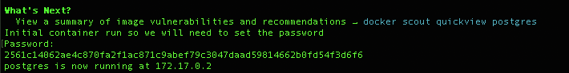

# Python Development Environment with PostGREs Tools
A repository to create a container that can be used to develop Python projects with Postgres SQL tools.

This repository is a scriptable way to create an environment that can be used to create 
- PostGREs SQL Server container running on port 5432
- PGAdmin4 container running on port 5050
- Python container that mounts the /src directory as /app on the container

## Requirements
- Docker Desktop for MacOs  
  (Have not yet tested on Linux but most likely it will work fine it's a TBD. Windows most likely will require rewritting to something like powershell)
- System that will allow access to the ports 5050 and 5432 for the PostGREs and PGAdmin4 containers
- TBD as things come to light  

## Usage
Follow the steps depending on if you have ran the scripts for a first time or not
### Create the PostGres container
#### PostGREs First Time
- Change to the directory of the cloned repository
- Run the ./create_postgres.sh specifying a value for the path to the data files.
  ```
  ./create_postgres.sh <datafile path>
  ```
  
  Note: If you don't provide a path it will default to ./data/postgres 
- When prompted enter the password you would like to use for the default administrator account  
  Note: This password is stored as a base 64 encoded string under the /data/persist/postgres file
- Take note of the IP address output by the script as you will need it for the PGAdmin connection


   
#### PGAdmin4 First Time
- Run the ./create_pgadmin.sh specifying a value for the path to the data files.
  ```
  ./create_pgadmin4.sh <datafile path>
  ```
  
  Note: If you don't provide a path it will default to ./data/pgadmin4 
- When prompted enter the password you would like to use for the default user@domain.org account  
  Note: This password is stored as a base 64 encoded string under the /data/persist/pgadmin4 file

#### Python Development Container
- Run the ./create_python container specifying a value for the path to the source code of your python application  
  ```
  ./create_python.sh <datafile path>
  ```
  Note: This container by default only installs python3.11 and pip3.11 on an ubi9 image if you want more modify the Dockerfile

That's it you now have
- PostGREs server running at the ip address you took note
- PGAdmin4 running at http://localhost:5050
- python container running with a mount at /app to the path you supplied

#### Updating the PostGREs password
If you update the PostGREs password you will need to update the base64 encrypted file at /data/persist/postgres by using the update_postgres_password.sh script
```
  ./update_postgres_password.sh
```
This script will prompt you for the new password and if you ever need to stop and start it will have the correct password.  
Note: According to documentation here from the PostGREs folks https://hub.docker.com/_/postgres if data exists it is not supposed to use the password defined

#### Updating the PGAdmin password
If you update the PGAdmin password you will need to update the base64 encrypted file at /data/persist/pgadmin4 by using the update_pgadmin4_password.sh script
```
  ./update_pgadmin4_password.sh
```
This script will prompt you for the new password and if you ever need to stop and start it will have the correct password.  

#### Clean-up the environment
A word of caution this will delete everything related to the persistance and the python container that is built so be warned!
```
  ./clean_environment.sh
```


